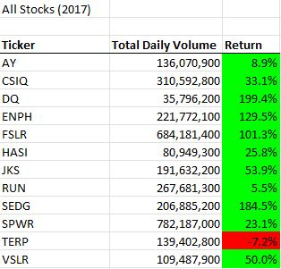

# VBA_Challenge

## Overview of Project
The purpose of this project was to use VBA to refactor the module's code to attempt to better optimize the process.

## Results

2017

Runtime:

2018

Runtime:

The return was able to be processed very fast for the entire sheet in both instances. But as we can see from the rerturn values, the 2017 year had exceptionally higher returns across the board. Even the fiew stocks in the green from the 2018 year, did not return as much as they had in 2017.

## Summary
The primary advantage of refactoring code is the ground work being laid already for the code you intend to use. This makes it easier to make small edits to optimize the specifics of what the code does. The primary disadvantage though, is that the code is already mostly made, and so 

The advantage of the starting code is that it is already in a functional state, but the disadvantage is that it is not fully optimized and streamlined as well as it can be.
